# 📘 Project Name: Ultimi  

### 🧩 Tagline  
**Learn smarter, not harder.**

---

## 🧠 Overview  

**Ultimi** is an **AI-powered web application** designed to help students study more effectively by transforming their learning materials into **personalized quizzes**.  

Students can upload a variety of file formats — including **PDFs, Word documents, PowerPoint slides**, or even **images of handwritten notes** — and Ultimi’s AI intelligently extracts key information to generate **interactive quizzes**, such as **multiple-choice**, **true/false**, and **short-answer** questions.  

The platform also features a **built-in question bank** for additional practice and a **leaderboard system** that fosters motivation through friendly competition.  

Beyond enhancing learning efficiency, **Ultimi promotes educational equity** by offering **scholarships and financial support** to underprivileged but hardworking students. Sponsored by organizations and partners, the system rewards the **top 27 students** on its yearly leaderboard, with the number of scholarships increasing as the user base grows.  

In the long term, **Ultimi aims to evolve into a global academic social network** — where students across all levels can **collaborate, share knowledge, and earn financial rewards** for their academic performance and engagement.  


## ⚙️ Features

Ultimi offers a comprehensive ecosystem of intelligent tools designed to make learning **engaging**, **interactive**, and **rewarding**.  
Every feature is built to enhance productivity, promote collaboration, and support both students and sponsors.

---

### 🧠 Ultimi AI Tutor  
Your personalized AI-powered tutor that helps prepare for **WAEC**, **JAMB**, and **NECO** exams.  
Students can upload handwritten notes, PDFs, or documents — and **Ultimi AI** will automatically generate **tailored quizzes**, summaries, and topic recommendations based on the uploaded materials.  
The AI also provides study advice, resource suggestions, and question explanations to deepen understanding.

---

### 📝 Built-in Quiz System  
An intelligent quiz engine that dynamically creates **multiple-choice**, **true/false**, and **short-answer** questions.  
Quizzes are sourced from the **central question bank** and enhanced with AI-generated questions derived from user-uploaded materials.  
Students receive **instant feedback**, **scoring**, and **performance analysis** after every quiz attempt.

---

### 🎯 Leaderboard  
Promotes a sense of achievement and friendly competition by ranking students based on:  
- Quiz performance  
- Activity consistency  
- Engagement with the platform  
This feature motivates users to stay active and rewards top performers with recognition and badges.

---

### 📊 Progress View  
Displays detailed analytics about each student’s learning journey.  
Students can view **quiz histories**, **average scores**, **time spent studying**, and **subject-level insights** to identify strengths and areas for improvement.  
Visual charts powered by **Recharts** and **Chart.js** make tracking progress fun and easy to understand.

---

### 🔥 Streaks  
Encourages continuous learning through **daily and weekly streaks**.  
Maintaining streaks unlocks **achievement badges**, boosts leaderboard position, and helps build strong, consistent study habits.

---

### 💬 Messages (Chat)  
A **real-time communication system** that connects students, tutors, and sponsors in one environment.  
This fosters collaboration, mentorship, and academic support through direct messaging and group discussions.  
Built with responsive and secure architecture for seamless cross-platform interaction.

---

### 📰 Opinions & Reports  
Allows users to **share feedback**, **report issues**, or **suggest improvements** directly from their dashboard.  
Collected insights help the Ultimi team continuously improve the platform’s features and user experience.

---

### 🧾 Flashcards  
Interactive and customizable **flashcards** for quick subject revision.  
Users can create, browse, and shuffle through flashcards — perfect for memorizing key concepts, formulas, or definitions.

---

### 🎓 Students Dashboard  
A **personalized learning hub** where students can:  
- View and manage quizzes  
- Track performance and streaks  
- Access AI-generated study materials  
- Connect with peers and sponsors  
It’s designed for clarity, engagement, and motivation.

---

### 💼 Sponsors Dashboard  
Provides sponsors and education partners with tools to:  
- Track student activity and academic performance  
- Monitor scholarship beneficiaries  
- Manage mentorship and support programs  
This feature promotes transparency and measurable impact in student sponsorship.

---

### 🔔 Notifications  
Delivers **real-time alerts** on:  
- New messages  
- Quiz completions  
- Leaderboard movements  
- Streak milestones  
- Upcoming events or updates  
Ensuring users never miss important activities or opportunities for engagement.

---

> ✨ **Ultimi bridges AI and education**, transforming traditional learning into an interactive, data-driven, and supportive experience for both students and sponsors.


## 🧑‍💻 Tech Stack  

Ultimi is built using **modern web technologies and libraries** to ensure scalability, performance, and a smooth user experience.

---

### 🖥️ Frontend  

- **Framework:** Next.js (v15.5.2) with React (v19.1.0)  
- **Styling:** Tailwind CSS, SASS, PostCSS, Autoprefixer, tw-animate-css  
- **UI Components:** Radix UI (modular UI primitives), Lucide Icons, Framer Motion (animations), clsx & class-variance-authority (conditional styling)  
- **Charts & Visualization:** Chart.js, React Chart.js 2, Recharts  
- **3D & Graphics:** Three.js, @react-three/fiber, @react-three/drei, three-stdlib, Vanta.js (background animations), Lottie React (illustrations & animations)  
- **Carousel & Effects:** Embla Carousel React, React Confetti  

---

### ⚙️ Backend & Services  

- **Backend Framework:** Next.js API Routes  
- **Database & Authentication:** Supabase  
- **Email & Notifications:** Nodemailer, Resend  
- **Data Fetching & Caching:** Axios, TanStack React Query  
- **Utilities:** Lodash, Date-fns, UUID  

---

### 🤖 AI & Media Integration  

- **AI Quiz Generation / Tutoring:** Gemini  
- **Audio & Video:** React Media Recorder, Wavesurfer.js (for audio visualization and playback)  
- **3D & Animation Tools:** Rive Canvas, Three.js  

---

### 🧰 Developer Tools  

- **Linting & Formatting:** ESLint, eslint-config-next  
- **Language & Types:** TypeScript  
- **Version Control:** Git  
- **Build Tools:** Next.js Build System, Tailwind Merge  


⚙️ Installation & Setup Instructions

Follow these steps to run Ultimi locally:

Clone the repository:

git clone https://github.com/<your-team>/<repository-name>.git
cd <repository-name>


Install dependencies:

npm install

```text

Create an environment file:
In the project root, create a .env.local file and add the required environment variables (e.g., Supabase keys, AI API keys, email credentials). Example:

NEXT_PUBLIC_SUPABASE_URL=
NEXT_PUBLIC_SUPABASE_ANON_KEY=
SMTP_HOST=
SMTP_PORT=
SMTP_USER=
SMTP_PASS=
RESEND_API_KEY=
GEMINI_API_KEY=

NEXT_PUBLIC_API_URL=https://questions.aloc.com.ng/api/v2/q
NEXT_PUBLIC_API_TOKEN=


Run the development server:
npm run dev


Open the app in your browser:

http://localhost:3000


## 🧭 Usage Guide

Once installed, you can:

1. **Create an Account or Log In**  
   Use **Supabase authentication** to securely access your Ultimi dashboard.

2. **Upload Study Materials**  
   Upload files in **PDF, Word, PowerPoint, or handwritten note** formats. Ultimi AI will automatically analyze and generate quizzes from them.

3. **Generate Personalized Quizzes with Ultimi AI**  
   Get **AI-driven advice, recommendations**, and **tailored quizzes** based on your uploaded materials.

4. **Access Your Dashboard**  
   Track your **learning progress**, **achievements**, **streaks**, and **leaderboard position**.

5. **Connect and Collaborate**  
   - Chat with peers and sponsors through the **Messages** section.  
   - Share insights and feedback in the **Opinions & Reports** area.  
   - Engage with community activities and sponsor programs.

6. **Interactive Learning Tools**  
   - Visit **Quiz** to take **WAEC, NECO, and JAMB** practice quizzes by subject and department (Science or Arts).  
   - Use **Flashcards** for focused study sessions and topic revisions.  
   - Explore the **Leaderboard** to see your ranking and progress.

---

### 🔍 Quick Navigation
| Section | Purpose |
|----------|----------|
| **Ultimi AI** | Get personalized advice, recommendations, and quizzes generated from uploaded files |
| **Quiz** | Take WAEC, NECO, and JAMB quizzes across all subjects and departments |
| **Opinions & Reports** | Submit feedback, suggestions, and improvement reports |
| **Messages** | Chat and communicate with students, sponsors, and the Ultimi community |
| **Dashboard** | Monitor your academic progress, streaks, and performance analytics |

---

> 💡 **Tip:** Stay consistent! Ultimi rewards active learners with engagement streaks, badges, and leaderboard recognition.


## 🔗 API & Library Reference

| **Library / API** | **Purpose** | **Documentation** |
|--------------------|-------------|-------------------|
| **Next.js** | Full-stack React framework for building scalable web apps | [nextjs.org](https://nextjs.org) |
| **React** | Declarative UI library for building dynamic interfaces | [react.dev](https://react.dev) |
| **Tailwind CSS** | Utility-first CSS framework for responsive, modern styling | [tailwindcss.com](https://tailwindcss.com) |
| **Framer Motion** | Powerful animation library for React components | [framer.com/motion](https://www.framer.com/motion) |
| **Radix UI** | Accessible and customizable UI components | [radix-ui.com](https://www.radix-ui.com) |
| **Supabase** | Open-source backend for authentication and database | [supabase.com](https://supabase.com) |
| **OpenAI API / Hugging Face** | AI-powered text and quiz generation | [openai.com/api](https://openai.com/api) / [huggingface.co](https://huggingface.co) |
| **Axios** | Promise-based HTTP client for API requests | [axios-http.com](https://axios-http.com) |
| **Chart.js / Recharts** | Interactive data visualization and analytics | [chartjs.org](https://www.chartjs.org) / [recharts.org](https://recharts.org) |
| **Three.js / R3F / Drei** | 3D rendering and graphics integration in React | [threejs.org](https://threejs.org) |
| **Lottie React** | Animation playback for vector-based illustrations | [lottiefiles.com](https://lottiefiles.com) |
| **Vanta.js** | Animated and interactive background effects | [vantajs.com](https://www.vantajs.com) |
| **Resend / Nodemailer** | Email delivery and notification management | [resend.com](https://resend.com) / [nodemailer.com](https://nodemailer.com) |
| **TanStack React Query** | Data fetching, caching, and synchronization | [tanstack.com/query](https://tanstack.com/query/latest) |
| **Wavesurfer.js** | Audio waveform visualization and playback | [wavesurfer.xyz](https://wavesurfer.xyz) |
| **Embla Carousel** | Smooth, customizable carousels and sliders | [embla-carousel.com](https://www.embla-carousel.com) |
| **Rive** | Real-time vector animation and state-driven motion | [rive.app](https://rive.app) |


Folder Structure:

```text
src/
 ├─ app/
 │   ├─ (auth)/
 │   │   ├─ login/
 │   │   │   └─ page.tsx
 │   │   ├─ register/
 │   │   │   └─ page.tsx
 │   │   └─ layout.tsx
 │   ├─ (main)/
 │   │   ├─ connections/
 │   │   │   └─ page.tsx
 │   │   ├─ dashboard/
 │   │   │   └─ page.tsx
 │   │   ├─ flashCard/
 │   │   │   ├─ [subject]/
 │   │   │   │   ├─ [topic]/
 │   │   │   │   │   └─ page.tsx
 │   │   │   │   └─ page.tsx
 │   │   │   └─ page.tsx
 │   │   ├─ leaderboard/
 │   │   │   └─ page.tsx
 │   │   ├─ messages/
 │   │   │   └─ page.tsx
 │   │   ├─ notifications/
 │   │   │   └─ page.tsx
 │   │   ├─ opinions/
 │   │   │   └─ page.tsx
 │   │   ├─ progress/
 │   │   │   └─ page.tsx
 │   │   ├─ quiz/
 │   │   │   ├─ domain-selection/
 │   │   │   │   └─ page.tsx
 │   │   │   ├─ home/
 │   │   │   │   └─ page.tsx
 │   │   │   ├─ preview/
 │   │   │   │   └─ page.tsx
 │   │   │   ├─ result/
 │   │   │   │   └─ page.tsx
 │   │   │   ├─ layout.tsx
 │   │   │   ├─ page.tsx
 │   │   │   └─ providers.tsx
 │   │   ├─ settings/
 │   │   │   └─ profile-setup/
 │   │   │       └─ page.tsx
 │   │   ├─ sponsors/
 │   │   │   ├─ page.tsx
 │   │   │   └─ types.ts
 │   │   ├─ streaks/
 │   │   │   └─ page.tsx
 │   │   ├─ ultimi-ai/
 │   │   │   └─ page.tsx
 │   │   ├─ users/
 │   │   │   └─ [id]/
 │   │   │       └─ page.tsx
 │   │   └─ layout.tsx
 │   ├─ api/
 │   │   ├─ chat/
 │   │   │   └─ route.ts
 │   │   └─ send-otp/
 │   │       └─ route.ts
 │   ├─ public/
 │   │   ├─ animations/
 │   │   │   ├─ Reactions.tsx
 │   │   │   ├─ clap.json
 │   │   │   └─ streak.riv
 │   │   ├─ FOCUS.jpeg
 │   │   ├─ He.jpeg
 │   │   ├─ Jesus.jpeg
 │   │   ├─ ghost.jpeg
 │   │   ├─ icon.jpg
 │   │   ├─ icon@.jpg
 │   │   ├─ index.ts
 │   │   ├─ notification.mp3
 │   │   ├─ squid.jpeg
 │   │   ├─ tooth.jpeg
 │   │   ├─ ultimi.jpeg
 │   │   └─ zoot.jpeg
 │   ├─ theme/
 │   │   └─ page.tsx
 │   ├─ favicon.ico
 │   ├─ globals.css
 │   ├─ layout.tsx
 │   └─ page.tsx
 ├─ components/
 │   ├─ ui/
 │   │   ├─ leagueBadge/
 │   │   │   ├─ BronzeCelebration.tsx
 │   │   │   ├─ CelebrationWrapper.tsx
 │   │   │   ├─ DiamondCelebration.tsx
 │   │   │   ├─ GoldCelebration.tsx
 │   │   │   ├─ PalladiumCelebration.tsx
 │   │   │   ├─ PlatinumCelebration.tsx
 │   │   │   └─ SilverCelebration.tsx
 │   │   ├─ popover.tsx
 │   │   ├─ tabs.tsx
 │   │   ├─ ProtectedRoute.tsx
 │   │   ├─ accordion.tsx
 │   │   ├─ alert-dialog.tsx
 │   │   ├─ app-sidebar.tsx
 │   │   ├─ avatar.tsx
 │   │   ├─ badge.tsx
 │   │   ├─ box.tsx
 │   │   ├─ button.tsx
 │   │   ├─ card.tsx
 │   │   ├─ carousel.tsx
 │   │   ├─ chart.tsx
 │   │   ├─ checkbox.tsx
 │   │   ├─ collapsible.tsx
 │   │   ├─ dialog.tsx
 │   │   ├─ dropdown-menu.tsx
 │   │   ├─ form.tsx
 │   │   ├─ input-otp.tsx
 │   │   ├─ input.tsx
 │   │   ├─ label.tsx
 │   │   ├─ pagination.tsx
 │   │   ├─ profileTextArea.tsx
 │   │   ├─ radio-group.tsx
 │   │   ├─ select.tsx
 │   │   ├─ separator.tsx
 │   │   ├─ sheet.tsx
 │   │   ├─ sidebar.tsx
 │   │   ├─ skeleton.tsx
 │   │   ├─ switch.tsx
 │   │   ├─ table.tsx
 │   │   ├─ textarea.tsx
 │   │   └─ tooltip.tsx
 │   ├─ widgets/
 │   │   ├─ coming-soon.tsx
 │   │   └─ mobile-nav.tsx
 │   └─ chart-area-interactive.tsx
 ├─ data/
 │   └─ questions.ts
 ├─ features/
 │   ├─ dashboard/
 │   │   ├─ components/
 │   │   │   ├─ index.ts
 │   │   │   ├─ league-badge-3d.tsx
 │   │   │   └─ league-badge-mesh.tsx
 │   │   ├─ context/
 │   │   │   └─ index.ts
 │   │   ├─ hooks/
 │   │   │   ├─ index.ts
 │   │   │   ├─ useChartOptions.tsx
 │   │   │   └─ useFetchStudentsStats.tsx
 │   │   ├─ dashboard.module.tsx
 │   │   └─ index.ts
 │   ├─ leaderboard/
 │   │   ├─ components/
 │   │   │   ├─ filters.tsx
 │   │   │   ├─ leaderboard-table.tsx
 │   │   │   ├─ league-filter.tsx
 │   │   │   ├─ pagination-controls.tsx
 │   │   │   ├─ search-input.tsx
 │   │   │   └─ table-content.tsx
 │   │   ├─ context/
 │   │   │   └─ index.ts
 │   │   ├─ hooks/
 │   │   │   ├─ useAuth.tsx
 │   │   │   ├─ useConnect.tsx
 │   │   │   ├─ useDataFetch.tsx
 │   │   │   ├─ useDataFilters.tsx
 │   │   │   ├─ useFetchData.tsx
 │   │   │   ├─ useFetchStudentsStats.tsx
 │   │   │   └─ useFilters.tsx
 │   │   ├─ index.ts
 │   │   └─ leaderboard.module.tsx
 │   ├─ messages/
 │   │   ├─ components/
 │   │   │   ├─ chat-background-wrapper.tsx
 │   │   │   ├─ chat-header.tsx
 │   │   │   ├─ chat-list.tsx
 │   │   │   ├─ message-input.tsx
 │   │   │   └─ message-list.tsx
 │   │   ├─ context/
 │   │   │   └─ index.ts
 │   │   ├─ hooks/
 │   │   │   ├─ useConnectedUsers.tsx
 │   │   │   ├─ useCurrentUser.tsx
 │   │   │   ├─ useDeleteMessage.tsx
 │   │   │   ├─ useMessages.tsx
 │   │   │   ├─ useOnlineStatus.tsx
 │   │   │   ├─ useRealtimeMessages.tsx
 │   │   │   ├─ useScrollBehavior.tsx
 │   │   │   ├─ useSendMessage.tsx
 │   │   │   └─ useSidebar.tsx
 │   │   ├─ index.ts
 │   │   └─ messages.module.tsx
 │   ├─ progress/
 │   │   ├─ components/
 │   │   │   ├─ activity-calendar.tsx
 │   │   │   ├─ progress-chart.tsx
 │   │   │   └─ index.ts
 │   │   ├─ hooks/
 │   │   │   ├─ useActivityData.ts
 │   │   │   ├─ useAggregatedData.ts
 │   │   │   ├─ useAvailableYears.ts
 │   │   │   ├─ useCalendarData.ts
 │   │   │   ├─ useCurrentDate.ts
 │   │   │   └─ useQuizScores.ts
 │   │   ├─ index.ts
 │   │   └─ progress.module.tsx
 │   ├─ quiz/
 │   │   ├─ components/
 │   │   │   ├─ LoadingSpinner.tsx
 │   │   │   ├─ NavigationButtons.tsx
 │   │   │   ├─ PreviewQuestion.tsx
 │   │   │   ├─ QuestionDisplay.tsx
 │   │   │   ├─ QuizForm.tsx
 │   │   │   ├─ ResultDisplay.tsx
 │   │   │   ├─ SubjectSwitcher.tsx
 │   │   │   ├─ SubmitButton.tsx
 │   │   │   └─ Timer.tsx
 │   │   ├─ context/
 │   │   │   └─ QuizContext.tsx
 │   │   └─ quiz.module.tsx
 ├─ hooks/
 │   └─ use-mobile.ts
 ├─ lib/
 │   ├─ fetchQuestions.ts
 │   ├─ questions.ts
 │   ├─ reactions.ts
 │   ├─ supabaseClient.ts
 │   ├─ types.ts
 │   └─ utils.ts
 ├─ schema/
 │   ├─ dashboard/
 │   │   ├─ index.ts
 │   │   ├─ leagues.ts
 │   │   └─ mock-data.ts
 │   ├─ message/
 │   │   └─ backgroundOptions.ts
 │   └─ index.ts
 ├─ styles/
 │   └─ globals.css
 ├─ types/
 │   ├─ dashboard.ts
 │   ├─ nodemailer.d.ts
 │   └─ vanta.d.ts
 ├─ utils/
 │   ├─ constants.ts
 │   ├─ formatters.ts
 │   └─ index.ts


👥 Team Information:

| Name                      | Role                 | GitHub                                       |
| ------------------------- | -------------------- | -------------------------------------------- |
| **Darlington Aja-ezo S.** | Full Stack Developer | [@darrojen](https://github.com/darrojen)     |
| **Gregory Okehie U.**     | Full Stack Developer | [@gregokehie](https://github.com/gregokehie) |

## 🖼️ Screenshots / Pages  

Here are a few preview screens showcasing **Ultimi’s interface and features.**  
*(Images are for demonstration — replace with your actual file paths if different.)*  

---

### 🎓 Core Pages

| Dashboard | Register | Login |
|------------|-----------|--------|
| 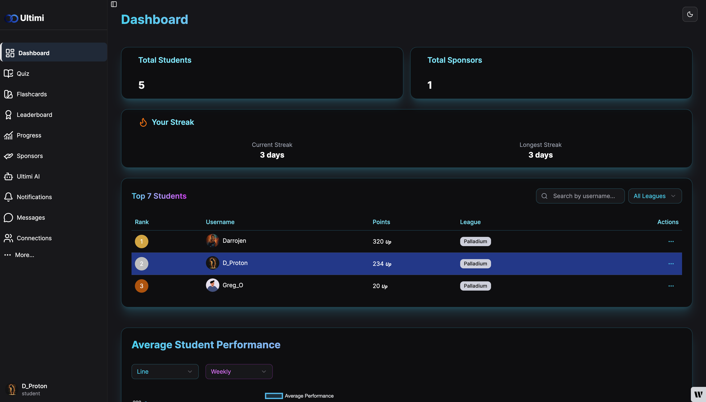 | 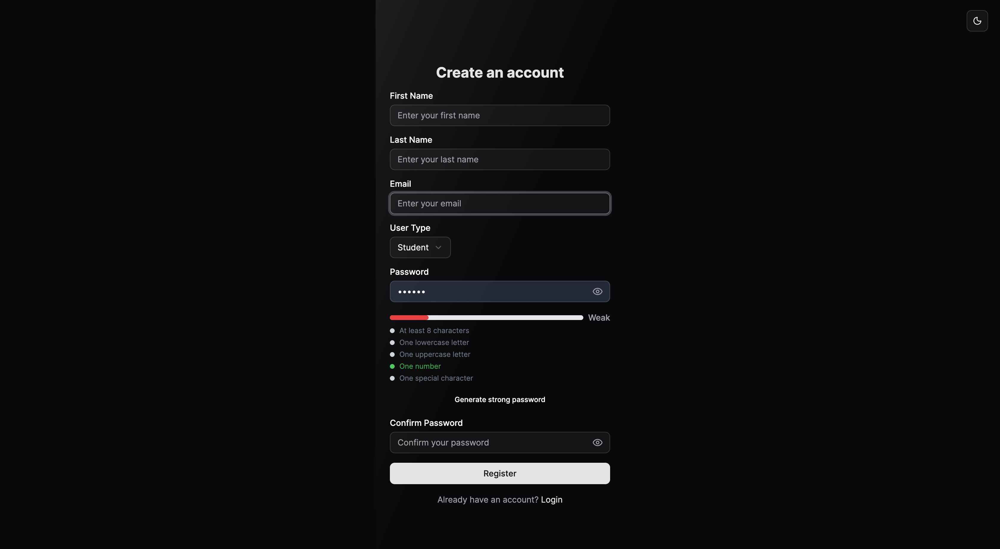 | 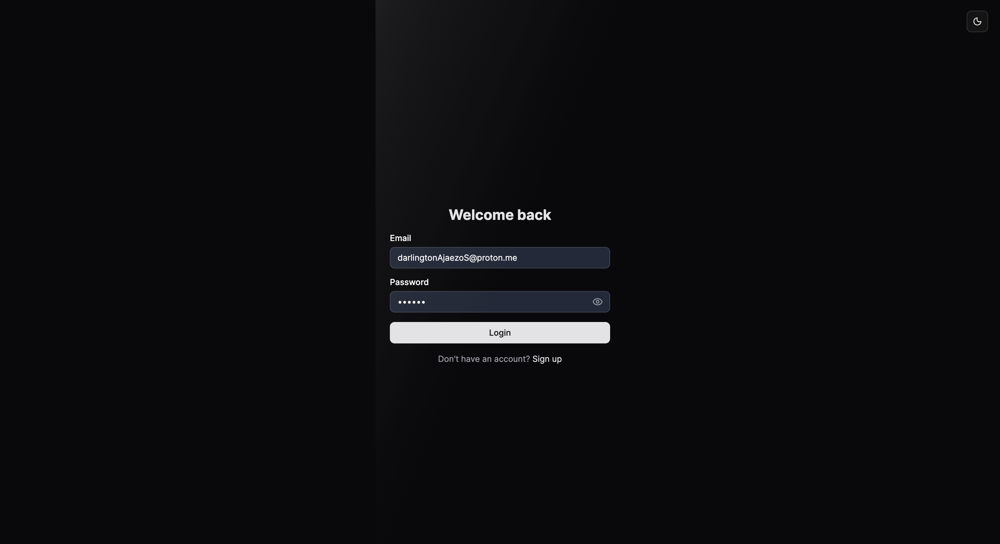 |

| Messages | Notifications | Opinions |
|-----------|----------------|-----------|
| 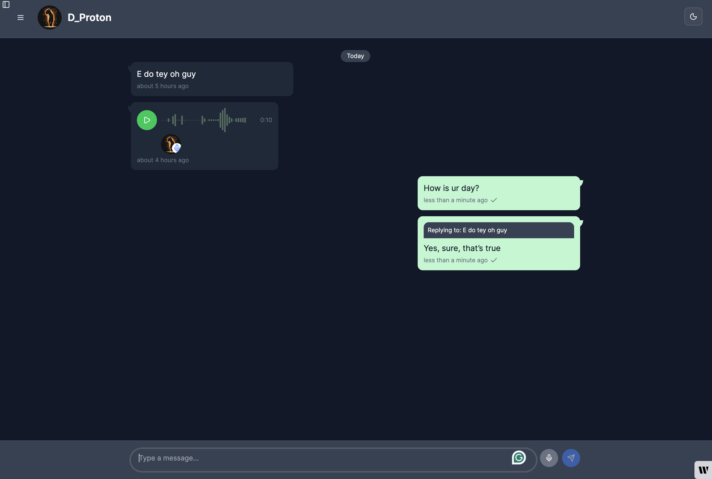 | 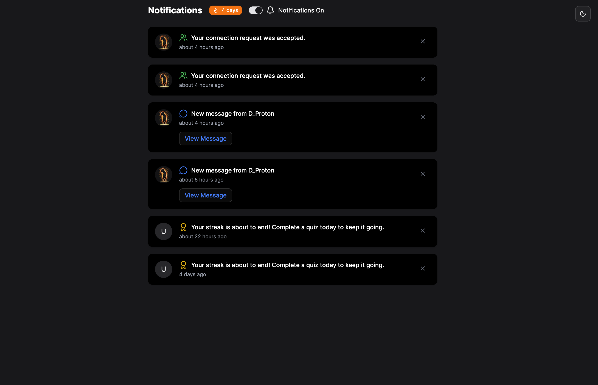 | 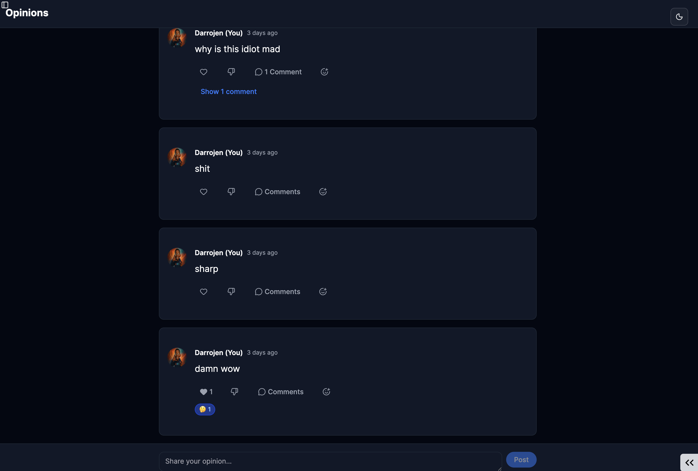 |

| Progress | Activity Calendar | Sidebar |
|-----------|-------------------|----------|
| 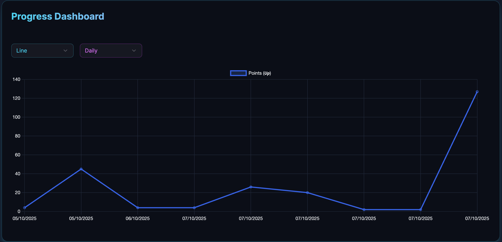 | 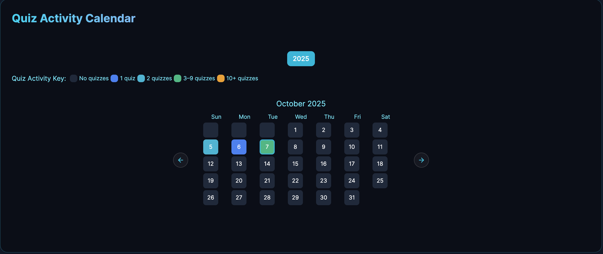 | 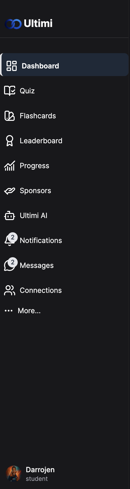 |

| Average Performance |
|----------------------|
| 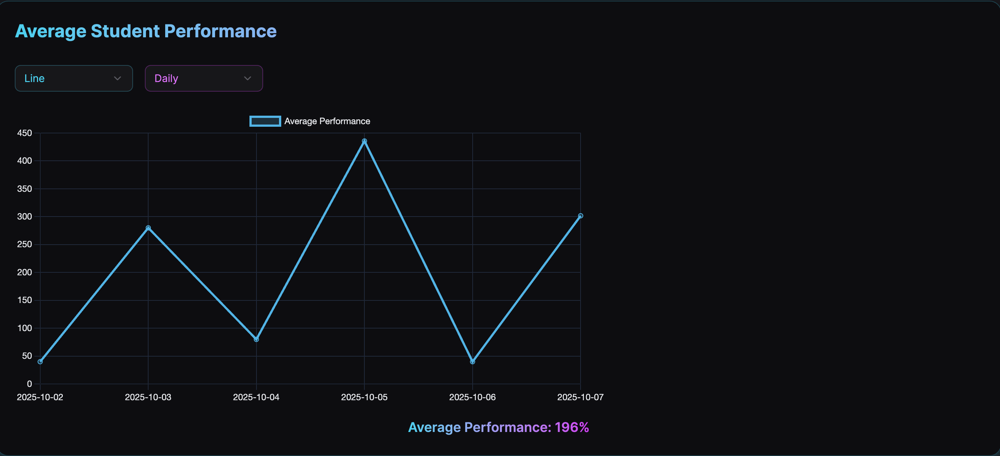 |
---

### 🧠 Learning & Quiz Pages

| Exam Type | Department Selection | Quiz in Progress |
|------------|----------------------|------------------|
|  | 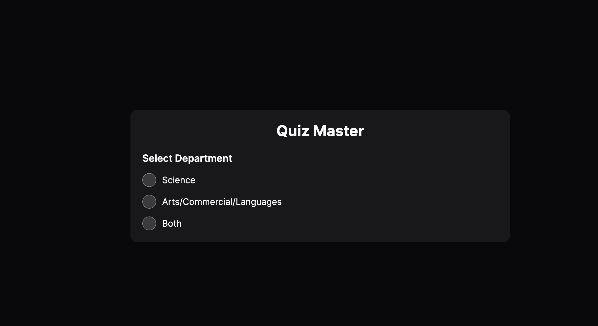 | 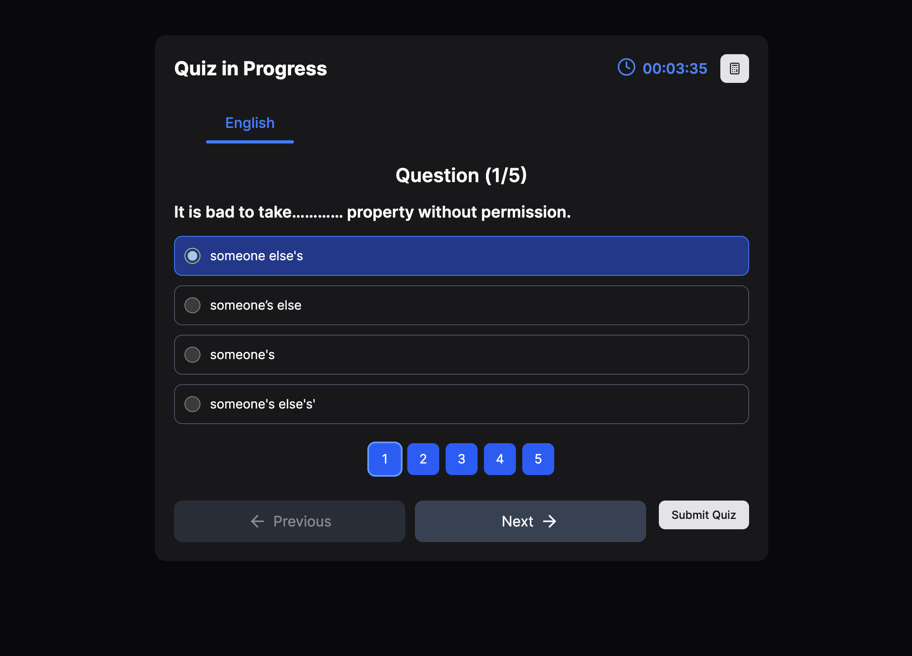 |

| Streak | Quiz Form | No Internet |
|--------|------------|--------------|
| 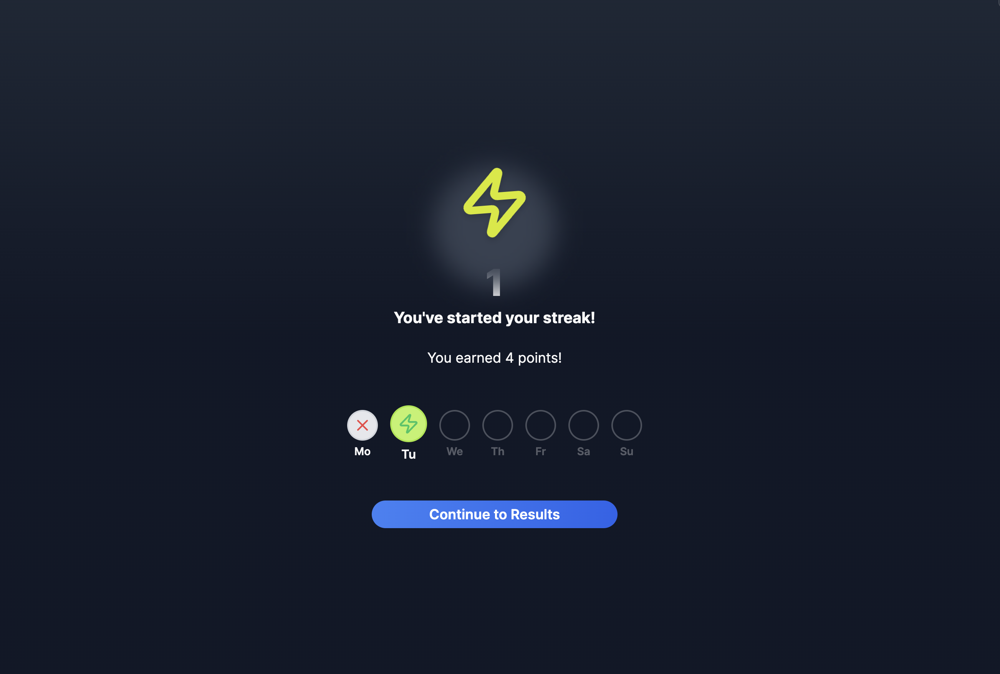 | 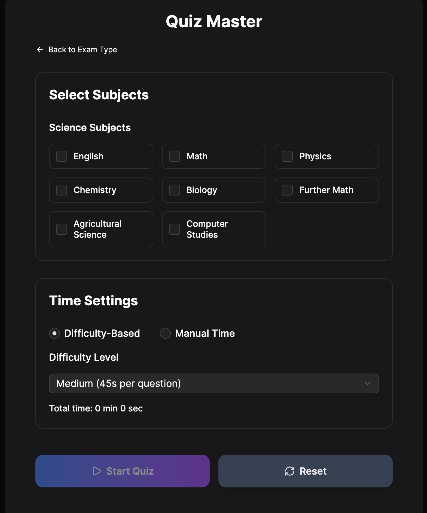 | 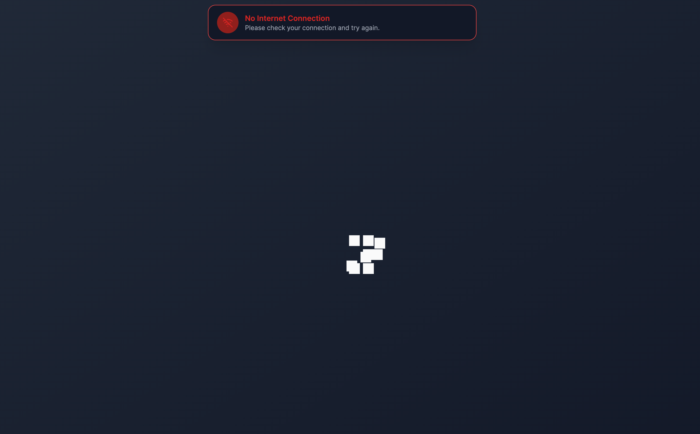 |

---

> 🧭 **Note:** These screenshots represent a snapshot of the **Ultimi platform** — showcasing its **clean UI**, **interactive dashboards**, **AI-powered quizzes**, and **engaging learning experience.**
